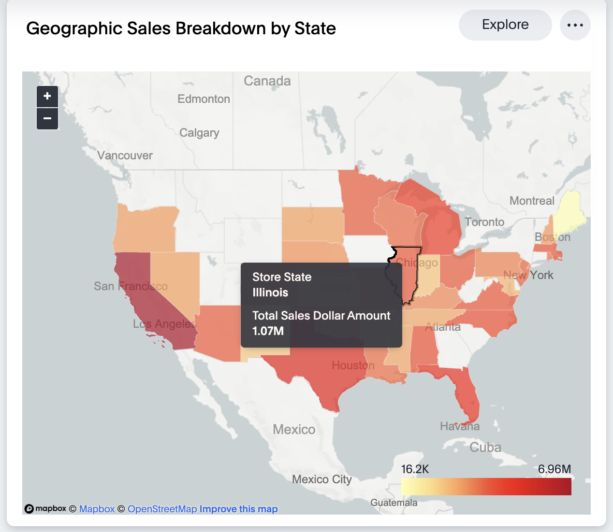

# python-sales-forecasting
Sales forecasting using python, BqML and Databricks ML

# Sales Forecasting with Python, BigQuery ML, Databricks ML, and ThoughtSpot

Sales forecasting is essential for businesses, enabling them to anticipate future sales based on historical data and market trends. This helps companies, including FMCG stores, to optimize production, inventory, marketing, and financial planning, and to align operations with expected demand and fostering growth. This README introduces an upcoming real-world example illustrating key techniques used to develop sales forecasting models, translating historical data into accurate predictions of future sales.

We initiate the process of building a sales forecasting model for Fast Moving Consumer Goods stores. We'll guide you through the essential steps and demonstrate how historical data and market trends can forecast future sales accurately. It's an exciting journey in data-driven decision-making - let's get started!

## Overview

We employed Python, BigQuery ML, Databricks ML and ThoughtSpot including the implementation of the XGBoost model to forecast retail sales. Leveraging these tools, we  generated sales forecasts for the next six months, demonstrating the power of advanced analytics in extracting insights from data to drive key business decisions and enhance sales forecasting accuracy. This project demonstrates how the application of sophisticated modeling techniques, such as XGBoost, in conjunction with leading data analysis platforms, can significantly enhance sales forecasting accuracy and guide key business decisions.

## Approach

We initiated the project by establishing connections to the respective databases using Python for Snowflake, BigQuery ML for Google BigQuery, and Databricks ML for the Databricks environment, ensuring access to necessary data.

Then we grabbed a historical sales dataset with info on sales and store demographics from different locations. This dataset had everything we needed to start digging in.

We cleaned up the data, got it into a nice Pandas DataFrame, and organized it around the 'Transaction_Date'. This made the data much easier to work with.

We decided to use XGBoost since it's great for problems like sales forecasting. We spent some time tuning it to fit our data just right - tweaking things like the learning rate and number of estimators.

### Actual vs Time Series Forecasting Predicted Line Chart: The reality check! Compare what we expected with what actually happened.

To facilitate efficient model retraining, we implemented Stored Procedures in the respective databases.

Subsequently, we evaluated the model's performance on three months of test data, yielding promising results.

### Forecast : The crystal ball of charts! Check out where the sales ship is sailing.

Now our XGBoost model is ready to start forecasting sales for the next 6 months. This will give us crucial insights to make better decisions.

Alright, buckle up! 🚀 Here's a sneak peek into our sales voyage with some awesome charts:

### Overall Sales : The KPI chart unveils insights into the sales performance.

### Yearly Sales Growth : This chart spills the beans on how sales have grown, step by step.

### Tender Type : Where's the money coming from? This pie chart gives breakdown of the revenue sources.

### Revenue Distribution by customer age group: Find out the revenue break down by age groups with this chart.

### Geographic Sales Breakdown by State: Ready for a state-by-state adventure? This chart maps out the sales journey across different regions.

### Guide to use .tml files
For step-by-step instructions on how to import .tml files into your ThoughtSpot cluster please refer [How to use TML files](https://docs.thoughtspot.com/cloud/latest/scriptability#_how_to_use_tml_files)
